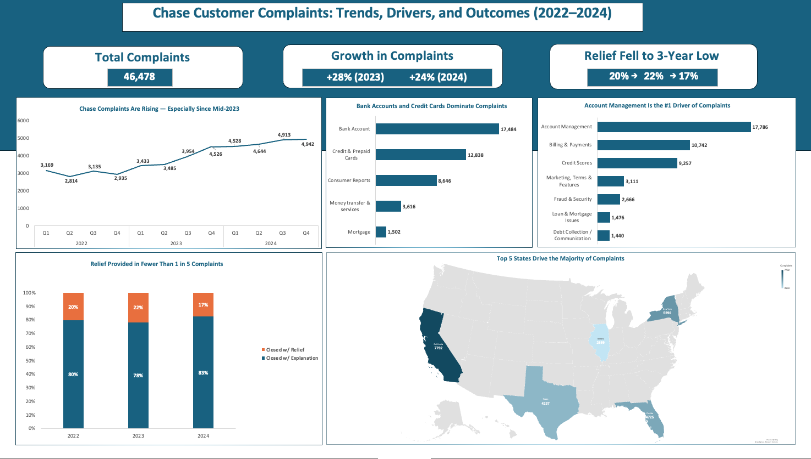

# Financial-Services-Complaint-Analysis

# 📊 Chase Customer Complaints Analysis (2022–2024)

## 1. Background & Overview
Chase, one of the largest U.S. banks, receives tens of thousands of consumer complaints each year through the Consumer Financial Protection Bureau (CFPB). This analysis examines **46k+ consumer complaints between 2022–2024**, covering the bank’s core product offerings including deposit accounts, credit cards, mortgages, and consumer lending.  

The project synthesizes complaint volume trends, resolution patterns, geographic distribution, and product-specific pain points to identify opportunities for operational improvements and improved customer experience.  

---

## 2. Data Structure & Initial Checks
The dataset included ~46,000 complaint records, with key fields including:  
- **Complaint ID** (unique identifier)  
- **Date Received**  
- **Product & Sub-Product** (e.g., credit cards, mortgages)  
- **Issue & Sub-Issue** (e.g., billing errors, account management)  
- **State** (location of consumer)  
- **Company Response to Consumer** (closed with explanation, closed with relief, etc.)  

**Additional Documentation**  
Technical documentation including the dataset, detailed methodology, and visuals of each chart can be found in this repository.  

---

## 3. Executive Summary

### Overview of Findings
- **Complaint Growth**: Increased 52% from 2022 to 2024, with growth accelerating (+28% in 2023, +24% in 2024).  
- **Products Driving Complaints**: Bank accounts and credit cards accounted for 65% of all complaints.  
- **Top Issues**: Account management, billing disputes, and credit reporting made up 81% of complaints.  
- **Resolution Patterns**: Relief rates declined from 22% to 17%, while “explanation only” resolutions rose to 83%.  
- **Geographic Hotspots**: Five states (CA, TX, FL, NY, IL) accounted for over half of all complaints, highlighting regional service gaps.  

---

### 📊 Dashboard Preview

  
---

## 4. Strategic Insights Deep Dive

### Rising Complaint Volume Highlights Systemic Challenges
Chase complaints grew **52% from 2022 to 2024**, with concerning acceleration in growth rates rather than stabilization. The 28% increase in 2023 followed by sustained 24% growth in 2024 indicates underlying operational or policy changes driving persistent customer dissatisfaction. This pattern highlights the need for a comprehensive customer experience audit across core service delivery channels.  

---

### Core Banking Products Drive Majority of Complaints
Bank accounts and credit cards collectively account for **30,322 complaints (65%)**, with checking accounts and general-purpose credit cards representing the highest-friction customer touchpoints. This concentration suggests that core retail banking products — the services used most frequently — are where customers encounter the most friction. Improvement in these areas would have the biggest impact on customer satisfaction.  

---

### Account Management Drives the Largest Share of Complaints
Account management complaints totaled **17,786 incidents (38%)**, representing the single largest customer pain point. These included account access, statement issues, and service representative interactions.  

Combined with billing disputes (**10,742 complaints**) and credit reporting problems (**9,257 complaints**), these three categories drove **37,785 complaints (81%)**. This concentration indicates specific operational processes requiring systematic redesign rather than product-level issues.  

---

### Declining Relief Rates May Impact Customer Trust and Retention
Customer relief rates declined consistently from **20% in 2022 to 17% in 2024**, while explanation-only resolutions increased to **83%**.  

This shift suggests either tightened internal resolution policies or improved complaint validity screening. However, from a customer experience perspective, declining relief rates during a period of increasing complaint volume may contribute to negative brand perception and customer attrition, particularly among high-value segments.  

---

### Five States Account for Over Half of Complaints
Five states—**California (7,792 complaints), Texas (4,237), Florida (4,725), New York (5,290), and Illinois (2,699)**—account for **52%** of all complaints.  

While population density partially explains this concentration, the disproportionate volumes indicate **regional operational variations or market-specific service delivery gaps that present opportunities for targeted improvement**.  

---

## 5. Recommendations
- **Strengthen product support** for bank accounts and credit cards, which generate 65% of complaints and represent core customer touchpoints.  
- **Investigate account management and billing processes** to address the top complaint drivers totaling 37,785 incidents (81%).  
- **Reevaluate resolution policies** as declining relief rates (22% → 17%) and heavy reliance on “explanation only” responses may damage customer trust.  
- **Target regional improvements** in California, Texas, Florida, New York, and Illinois, which account for 52% of complaints.  
- **Implement proactive monitoring** to identify and resolve issues before they escalate to formal complaints, particularly for high-frequency problems like account management and billing disputes.  

---

## 6. Methodology Notes

**Tools & Techniques**  
This project was done entirely in **Microsoft Excel**, leveraging:  
- **Power Query** for cleaning, filtering, and standardizing product/issue categories and preparing the dataset  
- **Pivot Tables** for aggregation  
- **Pivot Charts** (bar, column, line, and map charts) for visualizing key trends and distributions  
- **Calculated Fields** for year-over-year growth percentages  
- **KPI Cards** to highlight total complaints, growth rates, and resolution metrics  
- **Map Chart** for geographic hotspot analysis  

**Data Limitations**  
- Analysis limited to complaints filed through CFPB; does not capture internal complaint resolution or alternative channels.  
- Some complaint categories standardized may not perfectly align with internal Chase product classifications.  

